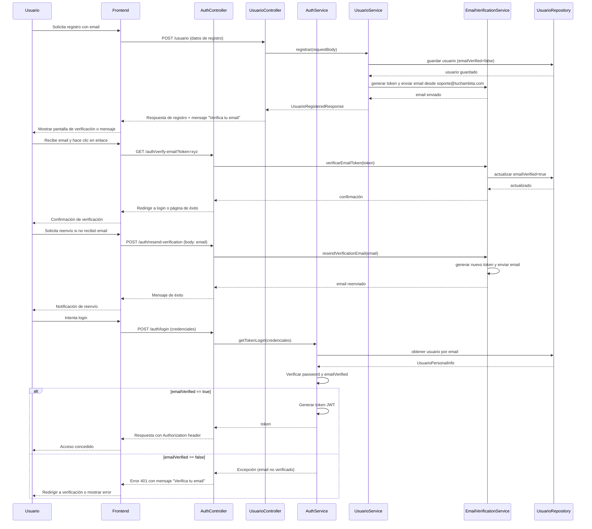

# Flujo de Registro y Verificación de Email

- Registro: Después de POST /usuario, mostrar mensaje para verificar email. No permitir login inmediato.
- Verificación: El enlace en el email apunta a una página frontend que llama GET /auth/verify-email?token=xyz. Manejar redirección post-verificación.
- Reenvío: Proporcionar opción en UI para reenviar email si no llega.
- Login: Si falla por email no verificado, mostrar opción para verificar o reenviar.
- Errores: Manejar respuestas de error (401 para login sin verificación, 400 para token inválido).
- Emails: Los emails se envían desde soporte-dev@tuchambita.com (dev) o soporte@tuchambita.com (prod).

### Diagrama de Secuencia

